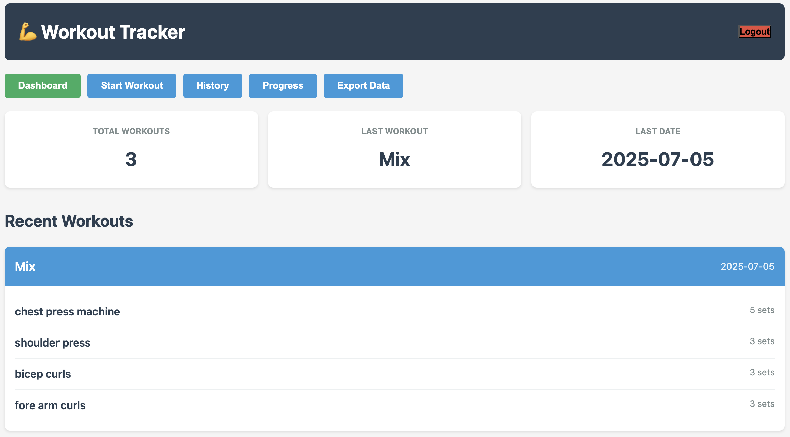
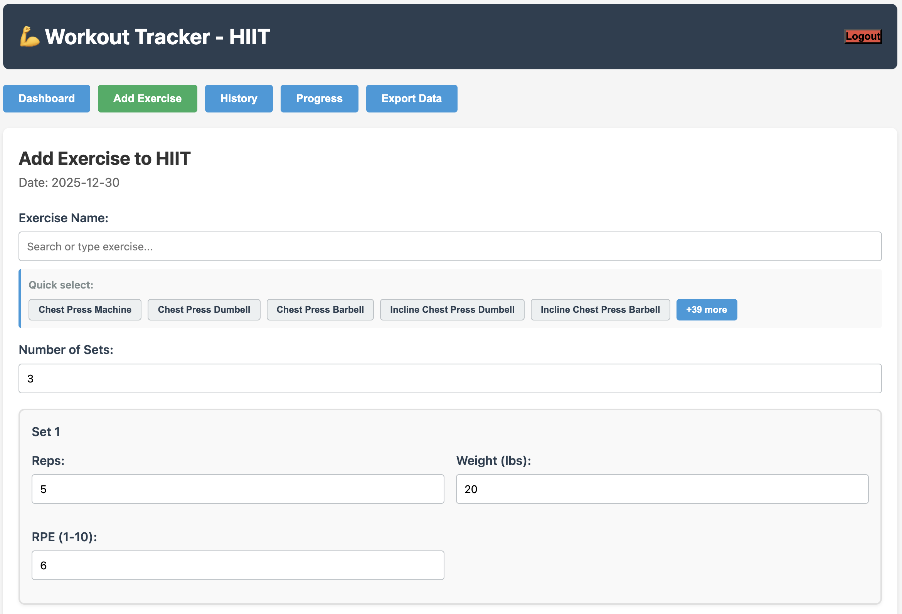
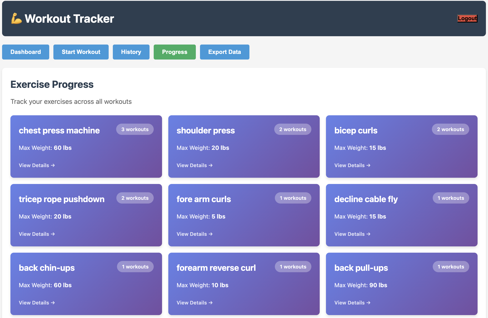
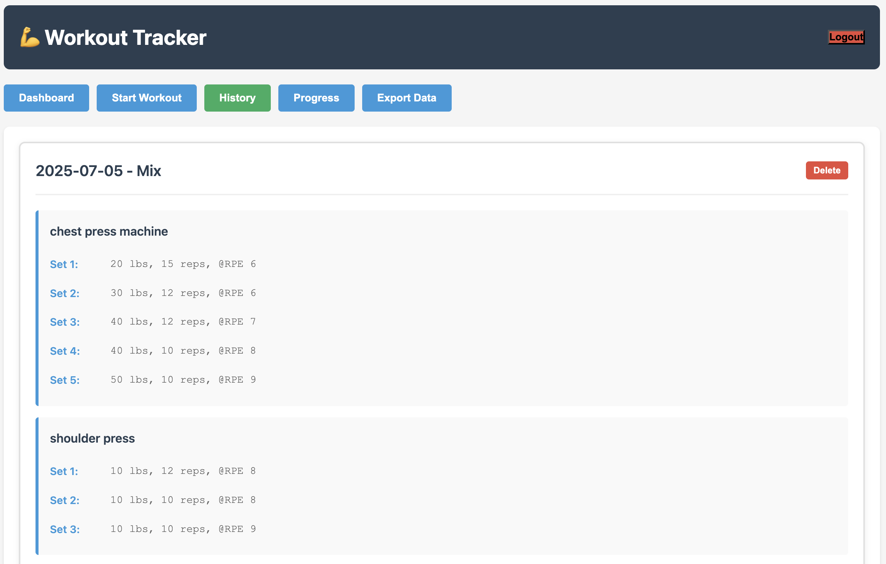

# 💪 Workout Tracker

Single-user fitness tracker demonstrating API design, data modeling, and security patterns.

## Screenshots

### Dashboard

### Add Workout

### Progress

### History

## 🎯 Core Implementation

**Hierarchical Data Model** — Workouts parent-child FK relationships to Exercises, cascade deletes, indexed queries  
**Fuzzy Matching Algorithm** — Levenshtein distance (>85% similarity threshold) deduplicates exercise names across sessions  
**Vanilla TypeScript** — 1000 LOC frontend, no framework dependencies, client-side SPA routing with state management  
**Security** — Parameterized SQL queries, bcrypt (10 rounds), JWT (7-day expiration), rate limiting (5/15min), CORS headers

## 🏗️ Stack

| Layer        | Tech                                       |
| ------------ | ------------------------------------------ |
| **Frontend** | TypeScript, HTML, CSS, Vite                |
| **Backend**  | Node.js, Express, TypeScript               |
| **Database** | SQLite3 (relational: workouts + exercises) |
| **Auth**     | bcryptjs, JWT                              |

## 🔒 Security Details

- **SQL Injection Prevention** — Parameterized queries only, no string concatenation
- **Password Storage** — bcrypt with 10 rounds, never plaintext
- **Authentication** — Stateless JWT with client-side token expiration checks
- **Rate Limiting** — 5 login attempts per 15-minute window
- **Headers** — CORS, X-Frame-Options, X-Content-Type-Options, Strict-Transport-Security

## 🧠 Design Highlights

- Per-set data (weight/reps/RPE) stored as JSON within relational schema
- Fuzzy matching prevents data fragmentation from user typos
- Client-side fuzzy search for real-time exercise suggestions
- Nested JSON export for backup/migration
- 10 REST endpoints with type-safe validators (backend + frontend)

## 🚀 Quick Setup

[QUICKSTART.md](QUICKSTART.md) (30 sec) | [SETUP.md](SETUP.md) (detailed) | [tool-setup.md](tool-setup.md) (tools)
